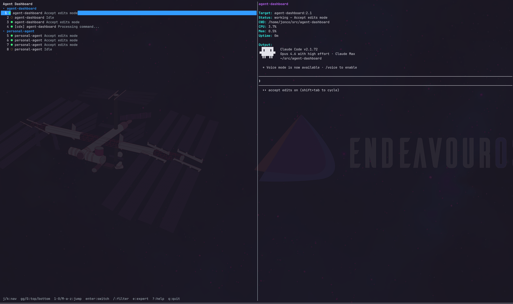

# Agent Dashboard

A live-updating TUI for monitoring Claude Code, Codex, and pi agent instances across tmux sessions. Built with Go and [Bubbletea](https://github.com/charmbracelet/bubbletea).




## Features

- Discovers Claude Code, Codex, and pi agents running in tmux panes
- Groups agents by project (tmux session name)
- Shows agent status (idle/active), uptime, and working directory
- Detail panel with todos, team info, and captured pane output
- Filter agents by name, session, or path
- Jump directly to an agent's tmux pane
- Detects team subprocesses plus Codex/pi wrapper processes

## Prerequisites

- **Go 1.25+**
- **tmux** (agents must be running inside tmux sessions)
- Linux (uses `/proc` for process inspection)

## Install

```bash
go install github.com/jonco/agent-dashboard/cmd/dashboard@latest
```

Or build from source:

```bash
git clone https://github.com/jonathoneco/agent-dashboard.git
cd agent-dashboard
go build -o agent-dashboard ./cmd/dashboard
```

Optionally symlink into your PATH:

```bash
ln -sf "$(pwd)/agent-dashboard" ~/.local/bin/agent-dashboard
```

Or use the included Makefile:

```bash
make build    # rebuilds ./agent-dashboard
make install  # rebuilds and refreshes ~/.local/bin/agent-dashboard
```

## Usage

Run in a dedicated tmux session:

```bash
tmux new-session -d -s dashboard 'agent-dashboard'
```

### tmux keybinding

Add a toggle keybinding to your tmux config to quickly switch to/from the dashboard:

```tmux
bind-key C-d if-shell '[ "#{session_name}" = "dashboard" ]' 'switch-client -l' 'switch-client -t dashboard'
```

### Key Bindings

| Key | Action |
|-----|--------|
| `j` / `↓` | Move down |
| `k` / `↑` | Move up |
| `Enter` | Jump to agent's tmux pane |
| `p` | Pin/unpin selected agent |
| `[` / `]` | Move selected pinned agent up/down |
| `/` | Filter mode |
| `Esc` | Clear filter |
| `r` | Force refresh |
| `q` | Quit |

## How It Works

The dashboard polls `tmux list-panes -a` every 2 seconds to discover agent processes. It identifies agents by matching `pane_current_command` against `claude`, `codex`, `pi`, or semver patterns (Claude team subprocesses). Agent status is parsed from tmux pane titles when available, and additional metadata is gathered from `/proc/<pid>/cmdline`, `~/.claude/teams/*/config.json`, `~/.claude/todos/*.json`, `~/.codex/sessions`, and `~/.pi/agent/sessions`.

Pinned agents are stored in `~/.config/agent-dashboard/pins.json` and rendered in a dedicated `Pinned` section at the top in the order they were pinned.

## License

MIT
